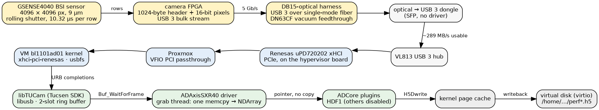
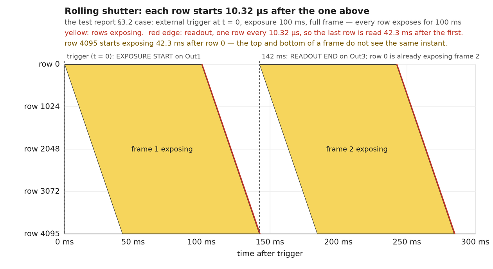
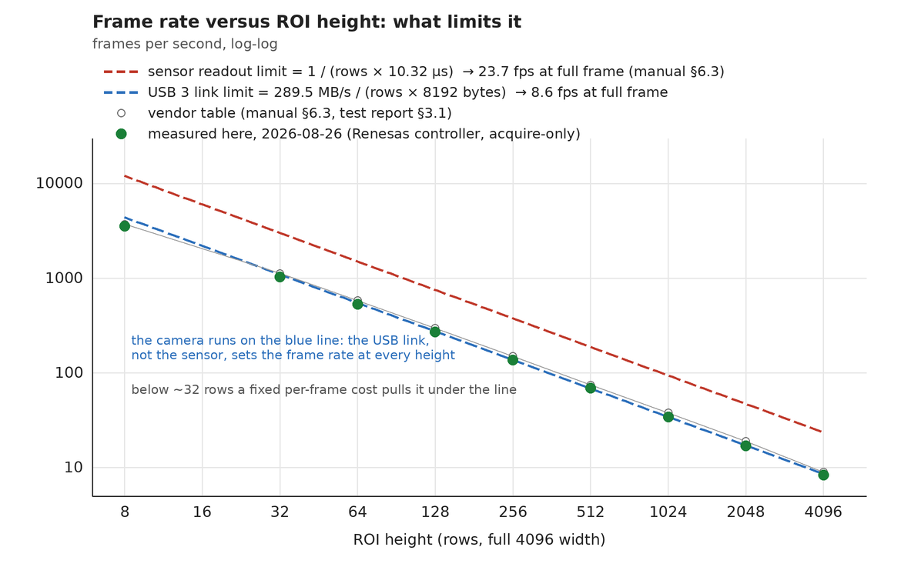
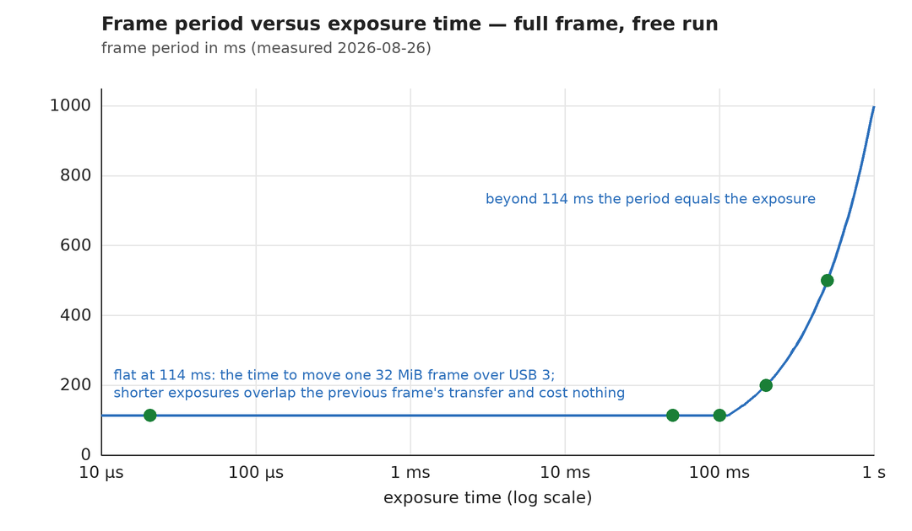
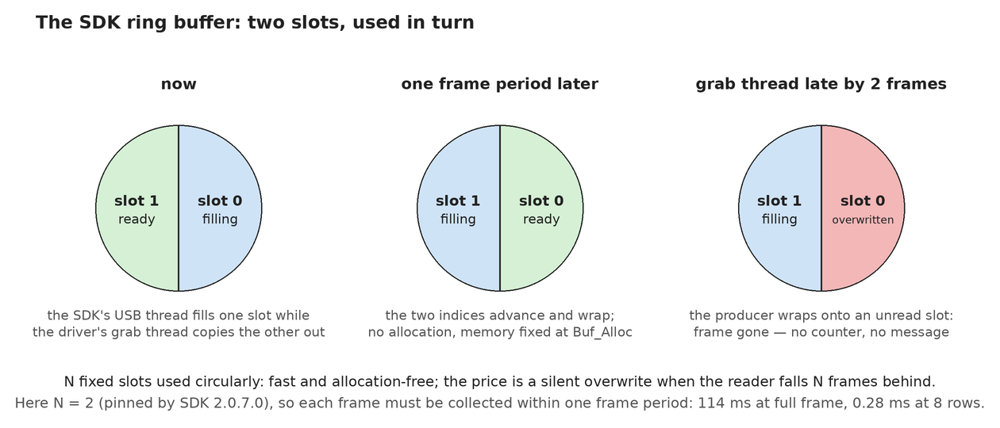
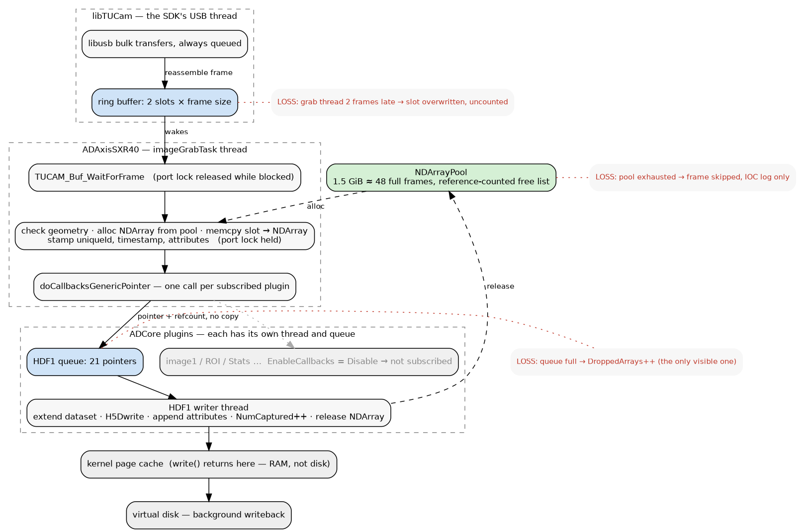
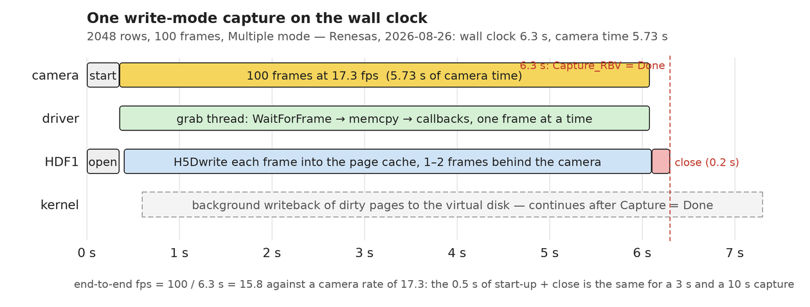

# How acquisition works — from the sensor to the `.h5` file

A frame's journey through this system, told once in plain language and then stage by
stage. Written 2026-08-26 against the code as it stands, the AXIS manual and factory test
report (in `../manuals/`, local working tree only), and measurements taken on
`bl1101ad01`. Line references are into
[axisSXR40.cpp](../../axisSXR40App/src/axisSXR40.cpp) and ADCore R3-14's `NDFileHDF5.cpp`.
Figures are in [acquisition/](acquisition/) and regenerated by
[acquisition/make-figures.py](acquisition/make-figures.py).

## The short version

The camera exposes and reads out its sensor one row at a time and pushes each finished
frame — 32 MiB at full size — down a fiber-optic USB 3 link. Inside the IOC, the vendor's
SDK lands the frame in a two-slot ring buffer; the driver's grab thread copies it **once**
into an areaDetector `NDArray` and hands a *pointer* to the HDF5 plugin; the plugin's own
thread writes it into the file. The file write goes into the kernel's RAM cache and drifts
to disk in the background.

Three numbers explain almost everything about its speed:

| | | |
|---|---|---|
| **10.32 µs** | time to read one sensor row (50 MHz pixel clock × 516 clocks, manual §6.3) | the sensor could do 23.7 full frames/s |
| **~289 MB/s** | what the USB 3 link actually carries | 32 MiB per frame → **8.6 fps**; this, not the sensor, is the limit |
| **114 ms** | the resulting full-frame period | any exposure shorter than this is free; longer, and the period becomes the exposure |

And three places a frame can be lost, only one of which is visible in a PV: the SDK ring
(overwritten, uncounted), the `NDArray` pool (skipped, IOC log only), and the plugin queue
(`DroppedArrays`, visible).

## 1. Inside the detector

The AXIS-SXR-40 is a Tucsen Dhyana XF4040BSI camera around a **GSENSE4040 BSI** sensor:
4096 × 4096 pixels of 9 µm, 37 × 37 mm, back-illuminated for 20 eV – 2 keV (test report
§2.2). It sits in vacuum; power and trigger signals go through a DB15 harness, the image
data through a single-mode fiber to an optical-USB 3 dongle at the computer (manual §5.1).

### Readout and the rolling shutter

The sensor has one ADC per column, so a whole row is digitised in one step: 516 pixel
clocks at 50 MHz = **10.32 µs per row** (manual §6.3). Rows are read top to bottom, and
each row begins its *next* exposure as soon as it has been read — the **rolling shutter**.
Every row is exposed for the same length of time, but row *n* starts 10.32 µs after row
*n − 1*, so in a full frame the last row starts 42.3 ms after the first. The factory test
(report §3.2) shows this directly on the camera's own outputs: EXPOSURE START on Out1 at
t = 0, READOUT END on Out3 at exposure + 42.3 ms.

For an experiment this means the top and bottom of a frame do not see the same instant.
The manual's worked example (§6.3): with a 10 kHz laser, a 167-row ROI and a 5 ms
exposure, every row accumulates 50 shots, but the first row sees shots 1–50 and the last
row shots 18–68.

### Frame rate: the USB link, not the sensor, sets it

Reading 4096 rows at 10.32 µs each takes 42.3 ms, so the sensor alone could deliver
23.7 fps; the vendor quotes 17 fps for the CameraLink version and 9–10 fps for USB 3
(manual §6.3, report §2.2). The USB figure is what we have, and it is a bandwidth limit:
a 32 MiB frame at the link's measured ~289 MB/s takes 116 ms, and the measured period is
114 ms. Halve the ROI height and the frame halves, so the rate doubles — down to about
32 rows, where a fixed per-frame cost starts to dominate and the rate falls under the
bandwidth line.

The vendor's table (manual §6.3, reproduced in the test report §3.1) and our measurements
agree within 10 % at every height; the full sweep is in [performance/](../performance/README.md).
Only the ROI *height* matters — the manual notes that reducing the number of columns does
not change the frame rate, because every row is read in full regardless.

### Exposure time and frame period

Because the rolling shutter lets a row expose while the previous frame is still being
transferred, exposure time is hidden behind the transfer time until it exceeds it.
Measured at full frame:

| Exposure | Frame period | fps |
|---|---|---|
| 20.64 µs | 114 ms | 8.75 |
| 50 ms | 114 ms | 8.75 |
| 100 ms | 114 ms | 8.75 |
| 200 ms | 200 ms | 5.0 |
| 500 ms | 500 ms | 2.0 |

The exposure range is 10.32 µs to 3600 s in steps of one row time — the camera stores it
internally as a row count ([camera notes](../camera/dhyana-xfxv4040bsi.md)).

### Is the camera always sending?

No. It streams only between `TUCAM_Cap_Start` and `TUCAM_Cap_Stop` (§4 below). Idle,
the only traffic is the driver's 0.5 s temperature poll on the control endpoint. And USB
bulk transfer is **host-driven**: the camera can only put bytes on the wire when the host
has a read request waiting. If the host stops posting requests — which is exactly what
`Cap_Stop` does, since it sends the camera no stop command — the camera's internal FIFO
fills and it discards frames on its own side, uncounted by anything.

### Trigger modes (manual §8.2)

- **Free run (internal)** — the camera reads out and uploads continuously at the rate
  above; this is what every measurement in this repository used.
- **Standard / Timed** — each external edge (rising or falling, selectable) starts one
  exposure of the software-set length. Trigger-to-exposure delay is 11 µs (manual
  §8.2 scope capture).
- **Standard / Width** — the exposure lasts as long as the trigger pulse is asserted.

In both external modes a trigger arriving before the previous frame is fully read out is
ignored, so the trigger period must exceed *delay + exposure + readout*. Three outputs
(EXPOSURE START, GLOBAL EXPOSURE, READOUT END, 3.3 V TTL) report the timing back. Trigger
modes have not yet been exercised from EPICS ([known gaps](../known-gaps/README.md)).

### What this stage cannot tell you

Whatever the FPGA puts in the stream is carried faithfully to disk. On 2026-08-26 that was
a test ramp instead of an image, and no counter anywhere downstream could see it
([TODO §8](../known-gaps/TODO.md)).

## 2. The USB link and the VM

Fiber → optical dongle → VL813 hub → **Renesas uPD720202** xHCI controller, which
Proxmox hands to the VM by PCI passthrough (VFIO). The guest kernel's `xhci-pci-renesas`
driver completes each bulk transfer into a buffer that libusb submitted on the SDK's
behalf, then raises an interrupt into the VM — one per transfer, so at 8 rows and
3568 fps, one every 280 µs. The previous controller (an ASMedia ASM2142 on a PCIe card)
mishandled the burst of cancelled transfers at stop and froze the IOC
([incidents/stop-deadlock.md](../incidents/stop-deadlock.md)). The camera enumerates as
`5453:e41b`; its bus number changes across reboots, so find it with `lsusb -d`.

## 3. The Tucsen SDK — the ring buffer

The driver never touches USB; it calls the vendor's closed `libTUCam`. The SDK owns a
**ring buffer** of frame slots in the IOC process.

A ring buffer is a fixed set of N equal-sized memory slots used circularly. The producer
— the SDK's USB thread — fills slot 0, then 1, … N − 1, then wraps to 0; the consumer —
our grab thread — takes them in the same order. Two indices ("next to fill", "next to
read") are the entire bookkeeping: nothing is allocated per frame and the memory is fixed
at start-up, which is why it is the standard structure for a device streaming into a
computer. The price is what happens when the consumer falls N frames behind: the producer
wraps onto a slot that has not been read yet and **overwrites it**. Nothing is queued,
nothing is counted; the frame is simply gone.

Here the ring is **2 slots deep** (`AXIS_BUFF_TOTAL`; SDK 2.0.7.0 honours `uiRsdSize`
only up to 2 — RELEASE change 11). So the grab thread must collect each frame within one
frame period of its arrival: 114 ms at full frame, 0.28 ms at 8 rows. `AXIS_BUFF_FRAMES`
shows how many slots currently hold unread data and sits at 2 whenever acquiring — the
ring running full, which is normal, not a warning.

The SDK's USB thread keeps libusb transfers queued so the controller always has somewhere
to put the next bytes, reassembles each frame into the current slot, and wakes whoever is
blocked in `TUCAM_Buf_WaitForFrame`.

## 4. The driver's grab thread

One dedicated thread, `imageGrabTask` ([:676](../../axisSXR40App/src/axisSXR40.cpp#L676)),
loops for the life of the IOC:

1. **Idle** — blocked in `epicsEventWait(startEventId_)`
   ([:708](../../axisSXR40App/src/axisSXR40.cpp#L708)). `Acquire = 1` from EPICS just
   signals that event (`startCapture`, [:1923](../../axisSXR40App/src/axisSXR40.cpp#L1923)).
2. **Start** — `TUCAM_Buf_Alloc` sizes the ring for the current ROI and format, then
   `TUCAM_Cap_Start(triggerMode)` tells the camera to run
   ([:731–732](../../axisSXR40App/src/axisSXR40.cpp#L731-L732)). This is the start-up
   part of the ~0.3–0.6 s per-capture overhead seen in the benchmarks.
3. **Per frame — `grabImage()`** ([:815](../../axisSXR40App/src/axisSXR40.cpp#L815)):
   - **releases the asyn port lock** and blocks in `TUCAM_Buf_WaitForFrame` with a
     timeout of exposure + margin ([:852–858](../../axisSXR40App/src/axisSXR40.cpp#L852-L858));
     re-takes the lock when a frame lands. Releasing the lock is what lets caputs be
     serviced while acquiring;
   - reads the frame's geometry from the SDK struct (`usWidth`, `usHeight`, `ucFormat`,
     `ucElemBytes`, `uiImgSize`) and checks it against the configured ROI — a mismatch is
     an error, not a silent copy;
   - **allocates an `NDArray` from the pool** — `pNDArrayPool->alloc`
     ([:1010](../../axisSXR40App/src/axisSXR40.cpp#L1010)). The pool is a free list of
     reusable buffers capped at **1.5 GiB** (`axisSXR40Config(..., 1610612736, ...)` in
     `st.cmd`), about 48 full frames. A buffer goes back on the free list when its last
     holder releases it; if every buffer is still held downstream, `alloc` fails and this
     frame is skipped with an error in the IOC log;
   - **copies the pixels** from the SDK slot (`pBuffer + usOffset`, past the 1024-byte
     header) into the NDArray — one `memcpy` when the frame is contiguous, one per row
     when the SDK pads rows ([:1061–1068](../../axisSXR40App/src/axisSXR40.cpp#L1061-L1068)).
     **This is the only pixel copy the driver makes**, and the SDK slot is free for reuse
     the moment it is done;
   - stamps the array — `uniqueId` from `ArrayCounter`
     ([:1074](../../axisSXR40App/src/axisSXR40.cpp#L1074)), the EPICS timestamp
     ([:1075](../../axisSXR40App/src/axisSXR40.cpp#L1075)) and the NDAttributes
     ([:1078](../../axisSXR40App/src/axisSXR40.cpp#L1078)). These become
     `NDArrayUniqueId`, `NDArrayTimeStamp` and `NDArrayEpicsTS*` inside the HDF5 file —
     what [tools/h5check](../../tools/h5check/) uses to prove that every frame the driver
     stamped reached disk, and to read the frame rate back out of the file.
4. **Hand-off** — `ArrayCounter` is incremented and, if `ArrayCallbacks` is enabled,
   `doCallbacksGenericPointer(pRaw_, NDArrayData, 0)`
   ([:800](../../axisSXR40App/src/axisSXR40.cpp#L800)) offers the array to every plugin
   subscribed to the driver's port. In `Multiple` mode the loop ends after `NumImages`;
   in `Continuous` it runs until `Acquire = 0`.
5. **Stop** — `stopCapture` ([:1933](../../axisSXR40App/src/axisSXR40.cpp#L1933)):
   `Buf_AbortWait` (breaks the grab thread out of its wait), `Cap_Stop`, `Buf_Release`.
   These run in the caller's thread under the port lock — the place where the ASMedia
   freeze lived.

Two other driver threads exist but carry no pixels: the 0.5 s temperature poll
(`TUCAM_Prop_GetValue`) and the asyn port thread that services record processing.

## 5. Plugin fan-out (ADCore)

`doCallbacksGenericPointer` runs *in the grab thread*, synchronously, once per subscribed
plugin. Each plugin's `driverCallback` does almost nothing: it increments the array's
reference count and **pushes a pointer onto its own queue** — `QSIZE = 21` in `st.cmd` —
then returns, and the grab thread goes back to the ring for the next frame. No pixels are
copied at this stage.

Only plugins with `EnableCallbacks = Enable` are subscribed. In the benchmarks that was
`HDF1` alone; `image1` (Channel Access display), the ROI, statistics and other file
plugins were all disabled, so the pipeline was literally driver → HDF1.

If a plugin's queue is full when a frame is offered, `driverCallback` drops the pointer
and increments **that plugin's** `DroppedArrays`. This is the only loss point directly
visible in a PV. It is what showed up as "drops" when the camera was left running while
HDF1 was closing a file: the writer thread was not draining its queue, 21 frames later the
queue was full, and everything after that was counted.

Reference counting is what makes fan-out cheap: one NDArray can be simultaneously queued
for HDF1, being displayed by `image1` and being processed by `Stats1`. The buffer returns
to the pool only when the last of them releases it — which is why the pool needs ~48
frames of headroom rather than 2.

## 6. NDFileHDF5 (`HDF1`) — the writer thread

The plugin's own thread pops one array at a time from its queue and calls
`processCallbacks` → `writeFile`. In **Stream mode** (`FileWriteMode = Stream`):

- **`Capture = 1`**, issued *before* acquisition starts: `openFile` builds
  `<FilePath>/<FileName>_NNN.h5` from `FileTemplate`, creates the default layout
  (`/entry/data/data`, `/entry/instrument/NDAttributes/*`) and creates the main dataset
  **with the dimensions of the last array the plugin saw**, extendable along the frame
  axis, chunked one frame per chunk. This is why the benchmark script primes one frame
  after every ROI change ([performance README, thing 1](../performance/README.md)) and why
  an un-primed `Capture` fails with "must collect an array to get dimensions first".
  Compression was off in every run here.
- **Per frame:** `extendDataSet` grows the frame axis by one; `H5Dwrite` writes the chunk
  straight from the NDArray's buffer; the attribute values (UniqueId, timestamps, …) are
  appended to their 1-D datasets; `NumCaptured` increments; the NDArray is released back
  to the pool. `HDF1:IOSpeed` (1500–2100 MB/s here) times only the `H5Dwrite` call — see
  below for why that is so much faster than any disk.
- **`NumCaptured == NumCapture`:** `closeFile` writes the on-close attribute datasets,
  closes every dataset and group handle, and calls `H5Fclose`. `Capture_RBV` goes to
  `Done`.

### Where the bytes actually are when `Capture` says `Done`

`H5Dwrite` ends in an ordinary `write(2)`, and Linux does not send a `write` to the disk.
It copies the bytes into the **page cache** — kernel-owned RAM that fronts the file —
marks those pages dirty, and returns. That copy runs at memory speed, which is the
1500–2100 MB/s `IOSpeed` reports. The kernel then writes dirty pages to the disk **in the
background**: a flusher thread starts once dirty memory passes `dirty_background_ratio`
(10 % of RAM ≈ 1.5 GB here) or pages are 30 s old, and a writer is only forced to wait if
dirty memory reaches `dirty_ratio` (20 % ≈ 3 GB). ADCore calls neither `fsync` nor
`H5Fflush` (checked in R3-14). So when `closeFile` returns, part of the file is typically
still in RAM and lands on the virtual disk over the next second or two. That is fine for
correctness — a clean shutdown or reboot flushes it — but "file closed" and "file on disk"
are different moments.

### What the close costs, and what it does not

The 2026-08-26 sweep gives the per-capture overhead directly: wall clock minus frames ÷
acquire-only rate = 0.48, 0.54, 0.57, 0.52, 0.47, 0.37, 0.56, 0.27 s for 100 → 10 000
frames and 0.66 → 3 GB files. It is **flat** — it grows with neither the bytes written nor
the frame count. It is camera start-up plus HDF5's own bookkeeping at close (attribute
datasets, handle closes, flushing HDF5's metadata cache). An earlier version of these notes
said "file-close time scales with file size"; that was an inference from two 2026-08-25
runs that differed in frame count as much as in bytes, and the 2026-08-26 data does not
support it. The one situation in which size *would* matter is a disk slower than the
stream: dirty pages then pile up to `dirty_ratio` and every `H5Dwrite` blocks at disk
speed. With a 280 MB/s camera and a 700–1000 MB/s disk that does not happen here.

## 7. Where frames are counted, and where they can be lost

| Stage | Counter or evidence | Loss possible? | Visible? |
|---|---|---|---|
| Camera → USB | none | camera FIFO overflow when the host stops reading | **no** |
| SDK ring (2 slots) | `AXIS_BUFF_FRAMES` (occupancy only) | overwritten if `WaitForFrame` is late by one period | **no** |
| Driver `grabImage` | `cam1:ArrayCounter_RBV` | `NDArrayPool` exhausted → frame skipped | IOC log only |
| Plugin queue | `HDF1:ArrayCounter_RBV`, `HDF1:DroppedArrays_RBV` | queue full (21) | **yes** |
| HDF5 write | `HDF1:NumCaptured_RBV`, file size | write error → `WriteStatus`, `WriteMessage` | yes |
| Page cache → disk | none from EPICS | power loss before writeback | no |
| Content | — | pattern instead of image | **only by looking at pixels** |

[tools/h5check](../../tools/h5check/) closes the loop from the file's end: a contiguous
`NDArrayUniqueId 1 … N` proves every frame the driver stamped reached the file, the
in-file camera timestamps give the frame rate without trusting anything upstream, and the
pixel statistics are the only check on stage one.

## 8. Thread and copy summary

| Thread | Owner | Holds the port lock while… | Touches pixels |
|---|---|---|---|
| SDK USB thread | libTUCam | never | writes the ring slot (DMA + reassembly) |
| `imageGrabTask` | driver | everything except the `WaitForFrame` block | **one memcpy**, ring → NDArray |
| asyn port thread | asyn | servicing each caput | no — but `Acquire = 0` runs `stopCapture` here |
| temperature poll | driver | each `Prop_GetValue` | no |
| HDF1 writer | NDFileHDF5 | plugin's own lock | `H5Dwrite` → page cache (kernel copy) |
| kernel flusher | Linux | — | page cache → disk |

Two copies of the pixels in user space (ring slot, NDArray), one in the kernel (page
cache), none on the way to the plugins.

## Sources

- AXIS-SXR-40 USB User Manual Rev1 — §5.1 system wiring, §6.1 image modes, §6.3 frame
  rate / ROI / rolling shutter, §8.2 trigger modes (`../manuals/`, local only).
- AXIS-SXR-40 s/n 702 Factory Test Report Rev1 — §2.2 sensor, §3.1 frame-rate table,
  §3.2 synchronisation scope capture.
- [camera/dhyana-xfxv4040bsi.md](../camera/dhyana-xfxv4040bsi.md) — what this unit
  actually implements, measured.
- ADCore R3-14 `NDFileHDF5.cpp`, `NDPluginDriver.cpp`; asyn R4-46 `asynPortDriver`.
- Measurements 2026-08-26 on `bl1101ad01`: exposure/period table, per-capture overhead
  ([performance/](../performance/README.md)).
